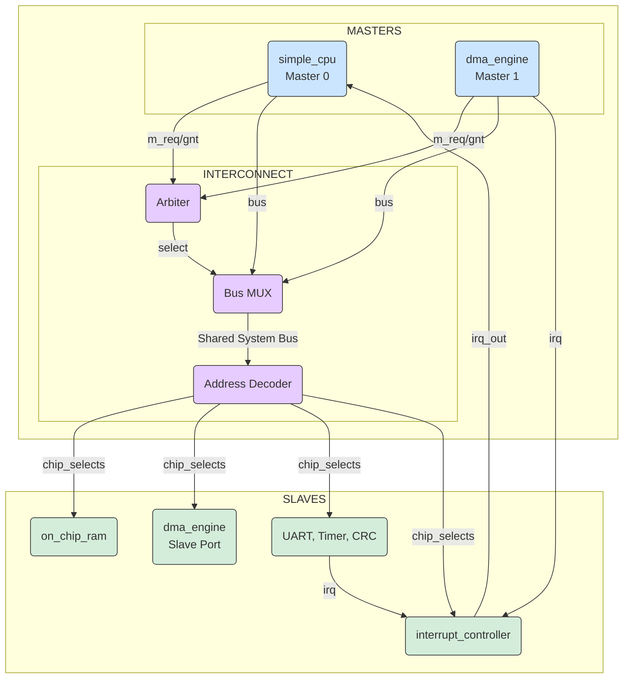

# A Multi-Master RISC-V SoC with DMA and Automated Verification


## 1. Overview

This project is a comprehensive, hands-on implementation of a complete 32-bit System-on-Chip (SoC) based on the RISC-V ISA. The architecture is designed around a **multi-master bus** to demonstrate real-world system-level challenges like bus arbitration, peripheral integration, and interrupt handling. The entire design is supported by a robust, **automated verification environment** built from the ground up using industry-standard principles.

The core narrative of the SoC is to showcase **hardware offload**: a low-power CPU delegates a bulk data transfer task to a specialized, bus-mastering DMA engine, which then interacts with other peripherals and signals completion via an interrupt.

## 2. Key Features & Architectural Highlights

- **Multi-Master Architecture:**
  - **Custom RISC-V CPU:** A simple, multi-cycle RV32I core serving as the primary control processor (Master 0).
  - **Bus-Mastering DMA Engine:** A dual-personality DMA that acts as a slave for configuration and a master for autonomous memory-to-memory transfers (Master 1).

- **System Interconnect:**
  - **Shared Bus Protocol:** A custom synchronous bus protocol with request/grant signals.
  - **Fixed-Priority Arbiter:** Manages bus contention, giving the CPU higher priority over the DMA.
  - **Memory-Mapped I/O:** All peripherals are accessed via a unified address map enforced by a central address decoder.

- **Suite of Peripherals:**
  - **64KB On-Chip SRAM:** Unified memory for CPU instructions and system data.
  - **CRC-32 Accelerator:** A hardware offload engine for data integrity checks.
  - **General-Purpose Timer:** A configurable timer capable of generating interrupts for real-time events.
  - **UART:** A standard serial communication interface for external communication and debugging.
  - **Multi-Source Interrupt Controller:** Aggregates and manages interrupt requests from the DMA, Timer, and UART.

- **Advanced Verification Environment:**
  - **UVM-like Principles:** The SystemVerilog testbench is architected using a layered approach inspired by UVM, featuring a Bus Functional Model (BFM), self-checking scoreboards, and directed & randomized tests.
  - **Fully Automated Regression:** A Python script manages the entire verification flow—compilation, execution of all tests, log parsing, and final report generation—enabling push-button testing and ensuring design quality.

## 3. System Block Diagram

This diagram illustrates the high-level architecture of the SoC, showing the interaction between masters, the interconnect, and slave peripherals.



## 4. Getting Started

### Prerequisites

To compile and run the verification suite for this project, you will need the following open-source tools installed on your system:

*   **[Icarus Verilog](http://iverilog.icarus.com/) (v10.0 or later):** Used as the primary Verilog and SystemVerilog simulator.
*   **[GTKWave](http://gtkwave.sourceforge.net/):** Used for viewing the `.vcd` waveform files generated during simulation for detailed debugging.
*   **[Python 3.6+](https://www.python.org/):** Required to execute the main automation and regression script.

### Running the Full Regression Suite

The entire verification process is managed by the `run_regression.py` automation script. This is the recommended way to test the design as it ensures all checks are performed.

1.  **Clone the Repository:**
    ```bash
    git clone <your-repository-url>
    cd risc-v-soc
    ```

2.  **Execute the Script:**
    From the root directory of the project, run the following command:
    ```bash
    python scripts/run_regression.py
    ```

The script will handle the compilation of all RTL and testbench files, execute the complete suite of defined tests (`DMA_TEST`, `TIMER_TEST`, etc.), parse the resulting log files for pass/fail signatures, and print a final summary report to your console.

### Running a Specific Test Manually

If you wish to run a single test case for focused debugging (e.g., to generate a specific waveform), you can do so manually.

1.  **Compile the Design (One-Time Step):**
    First, compile all the necessary files into a simulation executable named `soc_sim`. Make sure you are in the project's root directory.
    ```bash
    iverilog -g2005-sv -o soc_sim rtl/*.v rtl/*.sv tb/tb_risc_soc.sv
    ```

2.  **Run a Specific Test:**
    Execute the compiled simulation using `vvp` and pass the desired test name via the `+TESTNAME` plusarg. For example, to run only the DMA test:
    ```bash
    vvp soc_sim +TESTNAME=DMA_TEST
    ```
    To run the timer test:
    ```bash
    vvp soc_sim +TESTNAME=TIMER_TEST
    ```


## 5. Detailed Documentation

For a more in-depth look at the project's architecture, verification strategy, and results, please see the documents in the `docs` directory:

- **[Architectural Deep Dive](./architecture.md):** A detailed breakdown of the SoC architecture, including the memory map, bus protocol, and the roles of each IP block.

- **[Verification Strategy & Results](./verification.md):** A comprehensive explanation of the UVM-like testbench, BFM design, self-checking scoreboards, and an analysis of test results, including waveform diagrams.

- **[References](./references.md):** Links to external resources and specifications used in this project.


---
*This project is for educational and demonstration purposes. All content is copyrighted.*

