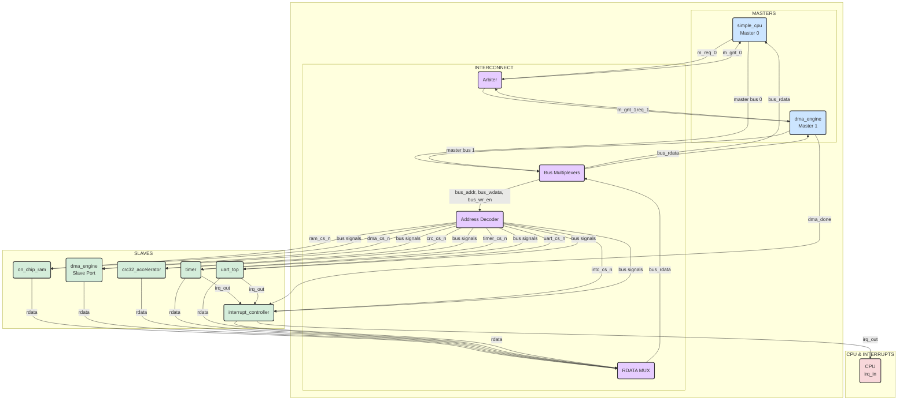

# Architectural Deep Dive

## 1. High-Level Philosophy

The SoC is designed as a **memory-mapped, multi-master system** built around a simple, synchronous shared bus. The architecture was deliberately chosen to explore the core challenges of system integration:
- **Resource Contention:** How to manage access when multiple masters (CPU, DMA) want to use the bus simultaneously.
- **System Integration:** How to connect disparate IP blocks (with different functions) into a cohesive whole.
- **Hardware/Software Interface:** How a processor controls and communicates with its peripherals via memory-mapped registers and interrupts.

## 2. System Block Diagram

The diagram below illustrates the flow of control and data signals between the masters, the central interconnect logic, and the slave peripherals.

## 3. Component Deep Dive

### The Masters
*   **`simple_cpu`**: The primary master, responsible for executing control code. It initiates bus transactions to fetch instructions and configure peripherals.
*   **`dma_engine`**: The secondary master. After being configured by the CPU via its slave port, it independently requests the bus to perform high-speed memory-to-memory transfers.

### The Interconnect
*   **`arbiter`**: A fixed-priority arbiter that resolves bus requests. It receives `m_req_0` (from CPU) and `m_req_1` (from DMA) and asserts a single grant (`m_gnt_0` or `m_gnt_1`), giving priority to the CPU.
*   **`Bus Multiplexers`**: A set of MUXs in `risc_soc.sv` that use the arbiter's grant signal as a select line to route the winning master's address, data, and control signals onto the shared system bus.
*   **`address_decoder`**: A purely combinational block that translates the upper bits of the system address bus into a single active-low chip select (`_cs_n`) signal for the target slave.

## 4. System Memory Map
The address space is partitioned as follows:

| Address Range           | Module                 |
|-------------------------|------------------------|
| `0x0000_0000-0x0000_FFFF` | `on_chip_ram`          |
| `0x0001_0000-0x0001_FFFF` | `dma_engine` (slave)   |
| `0x0002_0000-0x0002_FFFF` | `crc32_accelerator`    |
| `0x0003_0000-0x0003_FFFF` | `interrupt_controller` |
| `0x0004_0000-0x0004_FFFF` | `timer`                |
| `0x0005_0000-0x0005_FFFF` | `uart_top`             |
