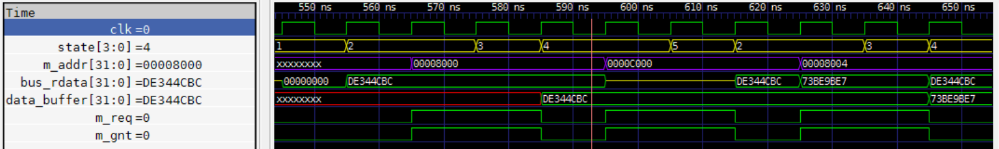
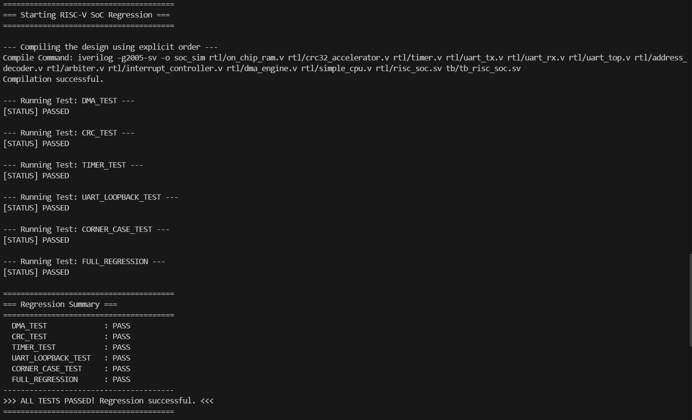

# Verification Strategy & Results

## 1. Verification Philosophy

The verification strategy for this project is built on the industry-standard principle that **verification should consume more effort than design**. The goal is not just to show that the design works ("positive testing"), but to actively try to break it by testing corner cases and complex interactions ("negative testing"). The entire environment is **automated** and **self-checking**.

## 2. The UVM-like Testbench Architecture

The system-level testbench (`tb/tb_risc_soc.sv`) is architected using principles from the Universal Verification Methodology (UVM) to create a scalable and layered environment.

- **Bus Functional Model (BFM):** The testbench does not require writing RISC-V assembly. Instead, it uses a BFM to directly control the CPU's bus interface. The `bfm_mode` port on the `simple_cpu` allows the testbench to disable the CPU's FSM and drive its bus signals. This provides precise, repeatable, and powerful stimulus generation.

- **Layered Tests (Sequences):** High-level tasks like `run_dma_test` act as sequences. They define a complete transaction (e.g., "configure the DMA, start it, wait for an interrupt") by calling a series of lower-level BFM tasks.

- **Self-Checking Scoreboards:** Every test is self-checking. After a transaction, scoreboard logic within the test automatically validates the result against a golden model. For example, the DMA test reads back the destination memory and compares it against the source, while the CRC test calculates the expected CRC in software and compares it against the hardware result. A test only passes if the scoreboard reports a match.

## 3. Waveform Analysis: Debugging a DMA Data Corruption Bug

One of the most critical bugs found during development was a data corruption issue in the DMA engine. The scoreboard reported that the data being written was stale or all zeros. This is a classic example of how waveform analysis is used to find the root cause.

#### The Symptom
The DMA transfer would "complete," and the interrupt would fire at the correct time, but the data copied to the destination memory was incorrect. This indicated a problem with the **data path**, not the main control flow.

#### The Waveform
The key was to analyze the precise timing relationship between the DMA's FSM state (`state`), its master bus signals (`m_addr`, `m_req`, `m_gnt`), the system's read data bus (`bus_rdata`), and the DMA's internal storage (`data_buffer`). The waveform below shows the **corrected, working design** and is used here to illustrate the bug and its solution.

*(A screenshot of the GTKWave session showing a successful DMA read-write cycle)*

#### In-Depth Waveform Interpretation

This analysis walks through a single, successful read-write cycle from **560ns to 610ns**, explaining how the design correctly handles memory latency. The FSM states are `S_IDLE=1`, `S_READ_ADDR=2`, `S_READ_WAIT=3`, `S_WRITE_ADDR=4`, `S_CHECK_DONE=5`.

1.  **The Request (Rising Edge at 560ns):**
    *   The FSM transitions from `1` (IDLE) to **`2` (S_READ_ADDR)**.
    *   Immediately, the DMA asserts its bus request (`m_req` goes high) and drives the first source address, **`0x00008000`**, onto its master address bus (`m_addr`). The DMA is now asking the system for the data at this location.

2.  **The Response (During the 570ns - 580ns cycle):**
    *   At the rising edge at **570ns**, the FSM transitions to **`3` (S_READ_WAIT)**.
    *   During this cycle, the `on_chip_ram` responds to the address presented in the previous cycle. We see the `bus_rdata` signal become valid, presenting the correct data from memory: **`0xDE344CBC`**.
    *   This is the critical observation: the data is only guaranteed to be valid on the bus during this single `S_READ_WAIT` cycle.

3.  **The Latch - The Critical Fix (Rising Edge at 580ns):**
    *   This is the moment the bug was fixed. At exactly **580ns**, two things happen simultaneously:
        1.  The FSM transitions from `3` (S_READ_WAIT) to **`4` (S_WRITE_ADDR)**.
        2.  The sequential logic `data_buffer <= m_rdata;` executes.
    *   As we can see in the waveform, the `data_buffer` signal is successfully updated with the value **`0xDE344CBC`** precisely at 580ns. The data has been safely captured inside the DMA.
    *   **The Original Flaw:** In the buggy design without the `S_READ_WAIT` state, the FSM would have gone straight from state 2 to 4. It would have tried to latch the data at 570ns, but at that point, `bus_rdata` was not yet valid, so it would have latched garbage.

4.  **The Write (During the 580ns - 590ns cycle):**
    *   Now in **`S_WRITE_ADDR` (state `4`)** and holding the correctly latched data, the DMA drives the destination address, **`0x0000C000`**, onto the `m_addr` bus and asserts `m_req` again to perform the write. The subsequent state (`5`, CHECK_DONE) will complete the transaction for this word.

This debugging session highlights a fundamental principle of bus-master design: **a master must be designed to tolerate the latency of the slaves it communicates with.** The addition of the `S_READ_WAIT` state explicitly handles the one-cycle read latency of our on-chip RAM, ensuring the data path is robust and reliable, as proven by this waveform.

## 4. Final Regression Results

The ultimate measure of the project's success is the passing report from the automated regression suite. The `run_regression.py` script executes all defined system-level tests and checks their output logs for a "PASS" signature.

The final output confirms that all tests, including the complex DMA and interrupt-driven scenarios, passed successfully.

****

*Screenshot showing the output of the `run_regression.py` script.*